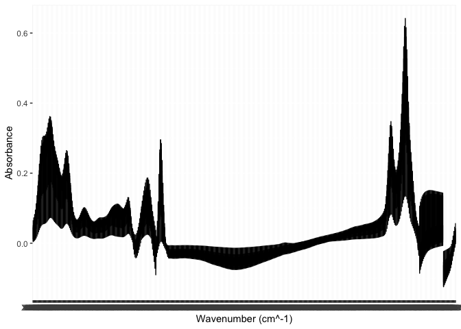
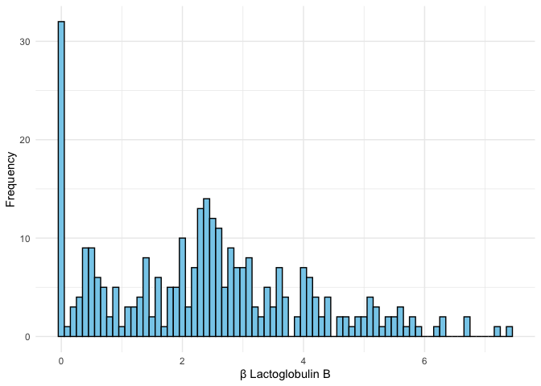
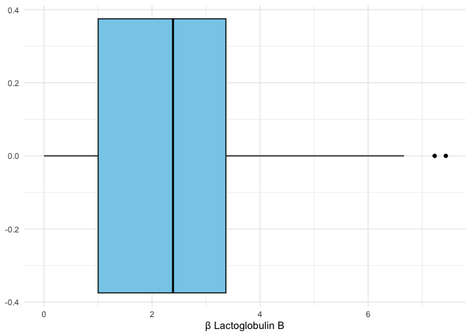
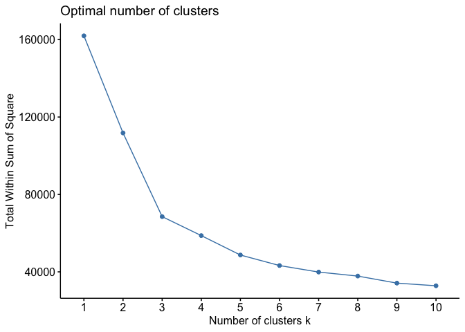
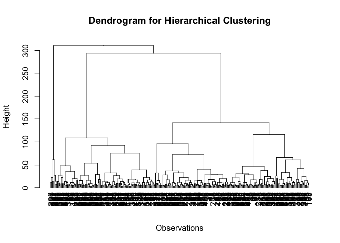
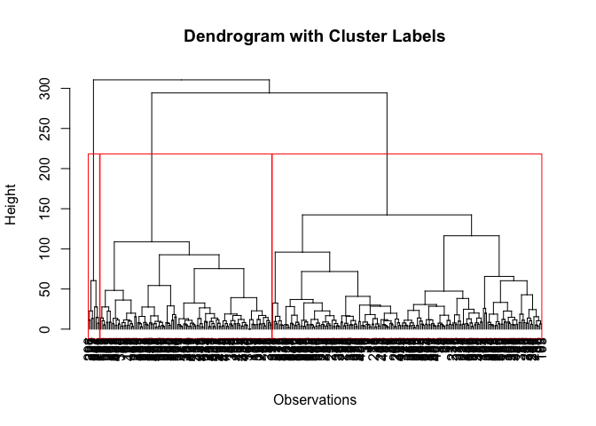
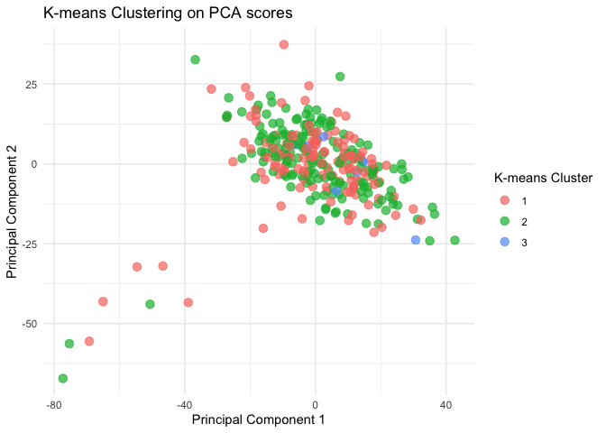
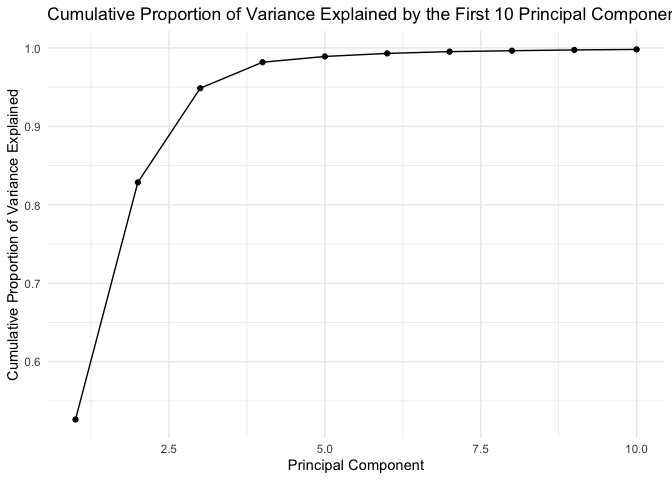
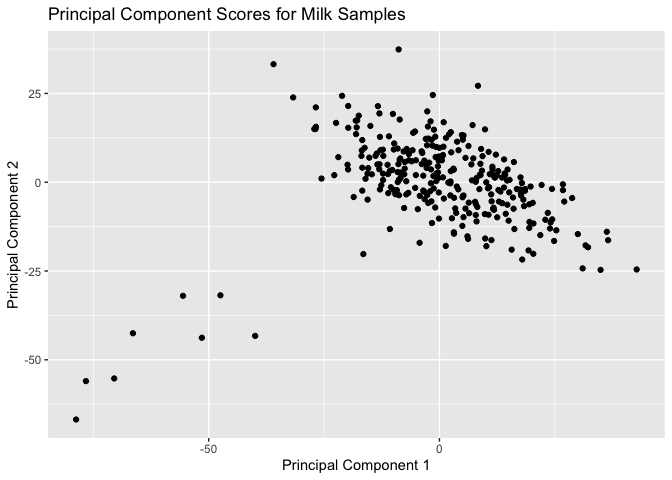

STAT40150 Multivariate Analysis Assignment
================
Aditya Prakash
2023-03-18

1.  Load the data set into R. Use the set.seed function in R to set the
    seed to your student number. Randomly generate a number between 1
    and n (where n is the number of rows in the dataset), and delete
    that observation/row from the dataset. Ensure that you include the
    code used in this step in the R code you submit with your assignment
    so that your work can be reproduced.

``` r
# Load the data set
data <- read.csv("/Users/adityaprakash/Downloads/Milk_MIR_Traits_data_2023.csv")

# Set the seed
set.seed(22201796)

# Generate a random number between 1 and n (number of rows)
n <- nrow(data)
rand_row <- sample(1:n, 1)

# Remove the randomly selected row from the dataset
data <- data[-rand_row, ]
```

2.  The milk protein β Lactoglobulin B is used in the production of
    protein drinks. Remove from the dataset any record/observation which
    has a missing/NA value for β Lactoglobulin B. Then, visualise the
    spectra and the protein trait β Lactoglobulin B using (separate)
    suitable plots. Comment on the plots. Remove any observations with β
    Lactoglobulin B outside of 3 standard deviations from the mean of
    the trait.

``` r
# Load the necessary libraries
library(ggplot2)
library(tidyr)

# Remove rows with missing values for β Lactoglobulin B
data <- data[!is.na(data$beta_lactoglobulin_b), ]

# extract the MIR spectra columns
spectra_cols <- data[, (ncol(data) - 530):ncol(data)]

# extract the wavenumbers from the header row
wavenumbers <- as.numeric(names(spectra_cols))
```

    ## Warning: NAs introduced by coercion

``` r
# convert the spectra columns into a long format
spectra_long <- spectra_cols %>% 
  gather(key = "wavenumber", value = "absorbance", 1:ncol(spectra_cols))

# plot all the spectra columns
ggplot(data = spectra_long, aes(x = wavenumber, y = absorbance, group = wavenumber)) +
  geom_line() +
  labs(x = "Wavenumber (cm^-1)", y = "Absorbance")
```

<!-- -->

``` r
# Remove observations with β Lactoglobulin B outside of 3 standard deviations from the mean
mean_beta_lactoglobulin_b <- mean(data$beta_lactoglobulin_b)
sd_beta_lactoglobulin_b <- sd(data$beta_lactoglobulin_b)
data <- data[abs(data$beta_lactoglobulin_b - mean_beta_lactoglobulin_b) <= 3 * sd_beta_lactoglobulin_b, ]

# Histogram of beta_lactoglobulin_b
ggplot(data = data, aes(x = beta_lactoglobulin_b)) +
  geom_histogram(binwidth = 0.1, fill = "skyblue", color = "black") +
  labs(x = "β Lactoglobulin B", y = "Frequency") +
  theme_minimal()
```

<!-- -->

``` r
# Boxplot of beta_lactoglobulin_b
ggplot(data = data, aes(y = beta_lactoglobulin_b)) +
  geom_boxplot(fill = "skyblue", color = "black") +
  labs(y = "β Lactoglobulin B") +
  theme_minimal() +
  coord_flip()
```

<!-- -->

Interpretation:

The MIR spectra plot displays the absorbance values for different
wavenumbers. Each line represents a spectrum from a single observation
in the dataset. The plot provides an overview of the general patterns
and variation in the absorbance data across the wavenumbers. Some
wavenumbers have higher absorbance values, which might be related to
specific chemical bonds or functional groups present in the samples.

After removing observations with β Lactoglobulin B values outside of 3
standard deviations from the mean, a histogram and a box plot of β
Lactoglobulin B values are generated. These plots provide an overview of
the distribution of β Lactoglobulin B values in the dataset.

The histogram shows the frequency distribution of β Lactoglobulin B
values, with the binwidth set to 0.1. The mean value of β Lactoglobulin
B appears to be around 2.5, and the distribution is roughly symmetric,
with most values falling close to the mean. The tails of the
distribution are thin, which indicates that extreme values are
relatively rare in the dataset.

The box plot is another way to visualize the distribution of β
Lactoglobulin B values. It shows the median, quartiles, and possible
outliers in the data. The box represents the interquartile range (IQR),
which contains the middle 50% of the data. The whiskers extend to the
minimum and maximum values within 1.5 times the IQR, and any data points
outside of this range are plotted as individual points, representing
potential outliers. In this case, the box plot also indicates that the
median value is close to the mean, and there are no visible outliers, as
they were removed in a previous step. The box plot confirms the
observations made from the histogram regarding the distribution of β
Lactoglobulin B values.

3.  Use hierarchical clustering and k-means clustering to determine if
    there are clusters of similar MIR spectra in the data. Motivate any
    decisions you make. Compare the hierarchical clustering and k-means
    clustering solutions. Comment on/explore any clustering structure
    you uncover, considering the data generating context.

``` r
# Load the necessary libraries
library(cluster)
library(factoextra)
```

    ## Welcome! Want to learn more? See two factoextra-related books at https://goo.gl/ve3WBa

``` r
library(ggplot2)

# Scale the MIR spectra data
spectra_scaled <- scale(spectra_cols)

# Create a separate data frame for the MIR spectra data
spectra_df <- data.frame(cbind(spectra = spectra_scaled, row_index = row.names(data)))
```

    ## Warning in cbind(spectra = spectra_scaled, row_index = row.names(data)): number
    ## of rows of result is not a multiple of vector length (arg 2)

``` r
# Elbow method to determine the appropriate number of clusters
wss <- numeric(10)
for (k in 1:10) {
  kmeans_res <- kmeans(spectra_scaled, centers = k, nstart = 25)
  wss[k] <- kmeans_res$tot.withinss
}

# Plot the total within-cluster sum of squares vs. the number of clusters
elbow_plot <- fviz_nbclust(spectra_scaled, kmeans, method = "wss")
print(elbow_plot)
```

<!-- -->

``` r
# Choose the appropriate number of clusters based on the elbow plot
k_optimal <- 3

# Hierarchical clustering
dist_matrix <- dist(spectra_scaled, method = "euclidean")
hc <- hclust(dist_matrix, method = "ward.D2")

# K-means clustering
set.seed(22201796)
kmeans_res <- kmeans(spectra_scaled, centers = k_optimal, nstart = 25)

# Add the cluster labels to the spectra data frame
spectra_df$hc_cluster <- cutree(hc, k = k_optimal)
spectra_df$kmeans_cluster <- kmeans_res$cluster

# Merge the cluster labels back to the original dataset
data <- merge(data, spectra_df[, c("row_index", "hc_cluster", "kmeans_cluster")], by.x = "row.names", by.y = "row_index")

# Compare the cluster solutions
table(data$hc_cluster, data$kmeans_cluster)
```

    ##    
    ##       1   2   3
    ##   1  15 167   0
    ##   2 116   0   0
    ##   3   0   0   8

``` r
# Plot the dendrogram for hierarchical clustering
hc_dendrogram <- as.dendrogram(hc)
plot(hc_dendrogram, main = "Dendrogram for Hierarchical Clustering", xlab = "Observations", ylab = "Height")
```

<!-- -->

``` r
# Add colored labels to the dendrogram based on the cutree result
cut_labels <- cutree(hc, k = k_optimal)
colored_labels <- rainbow(length(unique(cut_labels)))[as.numeric(factor(cut_labels))]
plot(hc_dendrogram, main = "Dendrogram with Cluster Labels", xlab = "Observations", ylab = "Height")
rect.hclust(hc, k = k_optimal, border = colored_labels)
```

<!-- -->

``` r
# Calculate the first two principal components
pca <- prcomp(spectra_scaled, center = TRUE, scale. = TRUE)
pca_scores <- pca$x[, 1:2]

# Create a data frame for PCA scores and cluster labels
pca_data <- data.frame(pca_scores, hc_cluster = data$hc_cluster, kmeans_cluster = data$kmeans_cluster)

# Plot the first two principal components colored by k-means cluster membership
ggplot(pca_data, aes(x = PC1, y = PC2, color = as.factor(kmeans_cluster))) +
  geom_point(size = 3, alpha = 0.7) +
  scale_color_discrete(name = "K-means Cluster") +
  labs(x = "Principal Component 1", y = "Principal Component 2", title = "K-means Clustering on PCA scores") +
  theme_minimal()
```

<!-- -->

We have used different clustering techniques and methods to analyze the
dataset. Here is a detailed explanation of the chosen functions,
methods, and the number of clusters in the code:

Libraries: We have used the following libraries for the analysis:
cluster: Provides various clustering algorithms and related utility
functions factoextra: Helps in extracting and visualizing the output of
various clustering and dimensionality reduction techniques ggplot2:
Provides a powerful and flexible way to create high-quality plots

Data preprocessing: We have scaled the MIR spectra data using the scale
function. This is done to standardize the data, which is necessary
before applying clustering algorithms, as it ensures that all features
have equal importance during clustering.

Elbow method: To determine the appropriate number of clusters (k) for
k-means clustering, we have used the elbow method. We calculate the
total within-cluster sum of squares (WSS) for different values of k (1
to 10) and plot WSS against k. The optimal k is the one where the plot
shows an “elbow” - a point after which the WSS decreases at a slower
rate. We found the optimal k to be 3.

Hierarchical clustering: We have used the hclust function with Ward’s
minimum variance method (ward.D2). This method aims to minimize the
total within-cluster variance. Ward’s method is often considered more
robust compared to other linkage methods.

K-means clustering: We used the kmeans function with the optimal number
of clusters determined by the elbow method. K-means is a popular
clustering algorithm due to its simplicity and efficiency. We also set
nstart = 25 to ensure the algorithm runs multiple times with different
initial centroids, reducing the risk of finding a local minimum instead
of the global minimum.

Comparing the cluster solutions: We have compared the clusters obtained
from hierarchical clustering and k-means clustering using a contingency
table. This table shows the distribution of observations across the
clusters generated by both methods, providing insights into how well the
two methods agree.

Visualizing the clustering solutions: We used the following
visualizations to help understand the clustering structure: Dendrogram
for hierarchical clustering: This plot shows the hierarchical structure
of the data and helps understand the relationship between the
observations. PCA plot: We performed Principal Component Analysis (PCA)
to reduce the dimensionality of the data and plot the first two
principal components. This plot allows us to visualize the clusters in a
two-dimensional space, making it easier to identify any apparent
structure in the data.

The output is a contingency table that compares the cluster assignments
of the observations resulting from the hierarchical clustering
(hc_cluster) and the k-means clustering (kmeans_cluster). Each cell in
the table shows the number of observations that are assigned to a
particular cluster in both clustering solutions. Here’s the
interpretation of the table:

\# k-means  
\# hc 1 2 3  
\# 1 15 167 0  
\# 2 116 0 0  
\# 3 0 0 8  

Cluster 1 in hierarchical clustering (hc_cluster) has 15 observations
that also belong to cluster 1 in k-means clustering (kmeans_cluster) and
167 observations that belong to cluster 2 in k-means clustering. No
observations in hc_cluster 1 belong to kmeans_cluster 3.

Cluster 2 in hierarchical clustering has 116 observations that also
belong to cluster 1 in k-means clustering. There are no observations in
hc_cluster 2 that belong to kmeans_cluster 2 or 3.

Cluster 3 in hierarchical clustering has 8 observations that also belong
to cluster 3 in k-means clustering. There are no observations in
hc_cluster 3 that belong to kmeans_cluster 1 or 2.

From this comparison, we can see that the two clustering methods do not
produce identical results, but there is some overlap in the assignment
of observations to clusters. For example, most observations assigned to
hc_cluster 1 are assigned to kmeans_cluster 2, and all observations in
hc_cluster 2 are assigned to kmeans_cluster 1. This indicates that the
two clustering methods agree to some extent, but they also have their
unique characteristics in how they form clusters.

4.  Apply principal components analysis to the spectral data, motivating
    any decisions you make in the process. Plot the cumulative
    proportion of the variance explained by the first 10 principal
    components. How many principal components do you think are required
    to represent the spectral data? Explain your answer.

``` r
# Load the necessary libraries
library(ggplot2)

# Perform PCA on the scaled spectral data
pca <- prcomp(spectra_scaled, center = TRUE, scale. = TRUE)

# Calculate the proportion of variance explained by each principal component
explained_variance <- pca$sdev^2 / sum(pca$sdev^2)

# Calculate the cumulative proportion of variance explained
cumulative_explained_variance <- cumsum(explained_variance)

# Plot the cumulative proportion of variance explained by the first 10 principal components
df <- data.frame(PC = 1:10, Cumulative_Variance = cumulative_explained_variance[1:10])

ggplot(df, aes(x = PC, y = Cumulative_Variance)) +
  geom_point() +
  geom_line() +
  labs(x = "Principal Component", y = "Cumulative Proportion of Variance Explained",
       title = "Cumulative Proportion of Variance Explained by the First 10 Principal Components") +
  theme_minimal()
```

<!-- -->

When applying principal components analysis (PCA) to the spectral data,
we made the following decisions to ensure a reliable and interpretable
analysis. Here, we discuss these decisions and explain why we believe
that 3 principal components are sufficient to represent the spectral
data.

Data preprocessing: Before performing PCA, we scaled the spectral data
so that each variable has a mean of 0 and a standard deviation of 1.
This step is crucial because PCA is sensitive to the scale of the
variables. If variables have different scales, the resulting principal
components may be dominated by the variables with larger scales, leading
to misleading results. By scaling the data, we ensure that all variables
contribute equally to the PCA.

Performing PCA: We used the prcomp() function in R to perform PCA on the
scaled spectral data. This function computes the principal components,
eigenvalues, and eigenvectors of the data. The resulting principal
components are linear combinations of the original variables, ordered by
the amount of variance they explain in the data. By using PCA, we aim to
reduce the dimensionality of the data while retaining as much
information as possible.

Plotting the cumulative proportion of variance explained: To determine
how many principal components are required to represent the spectral
data, we plotted the cumulative proportion of variance explained by the
first 10 principal components. This plot helps visualize the amount of
information captured by each additional principal component and assists
in selecting an appropriate number of components.

Identifying the elbow point: In the cumulative proportion of variance
explained plot, we observed an “elbow” at around 3 principal components.
The elbow point represents a threshold where adding more components
provides diminishing returns in terms of explained variance. This
suggests that the first 3 principal components capture a significant
proportion of the total variance in the data, while subsequent
components contribute relatively little additional information.

Based on the elbow point in the plot, we believe that 3 principal
components are sufficient to represent the spectral data. Using only the
first 3 components, we can reduce the dimensionality of the data while
still retaining a substantial amount of information. This simplifies
further analyses and reduces computational complexity without
sacrificing too much information from the original data.

5.  Derive the principal component scores for the milk samples from
    first principles (i.e., you should not use an inbuilt function such
    as predict(. . . )). Plot the principal component scores for the
    milk samples. Comment on any structure you observe.

``` r
# Load necessary libraries
library(ggplot2)

# Remove non-numeric columns
numeric_data <- data[, sapply(data, is.numeric)]

# Impute missing values with column medians
numeric_data <- apply(numeric_data, 2, function(x) replace(x, is.na(x), median(x, na.rm = TRUE)))

# Standardize the data
standardized_data <- scale(numeric_data)

# Calculate the covariance matrix
cov_matrix <- cov(standardized_data)

# Calculate eigenvalues and eigenvectors
eigen_results <- eigen(cov_matrix)

# Calculate the principal component scores
pc_scores <- standardized_data %*% eigen_results$vectors

# Convert to data frame
pc_scores_df <- as.data.frame(pc_scores)

# Plot the first two principal components
ggplot(pc_scores_df, aes(x = V1, y = V2)) +
  geom_point() +
  xlab("Principal Component 1") +
  ylab("Principal Component 2") +
  ggtitle("Principal Component Scores for Milk Samples")
```

<!-- -->

It appears that there are two distinct groups of observations in the
dataset.

One group of 8 observations located at the bottom left of the plot
(around coordinates (0, -30) for PC1 and (0, -25) for PC2). These
observations are likely to be different from the rest of the samples and
might represent a subgroup or a specific type of milk sample with unique
properties.

The other group is bunched around the top right and middle right of the
plot, representing the majority of the samples. This group is more
homogeneous and likely represents the typical properties of most milk
samples in the dataset. The first two principal components capture the
maximum variation in the dataset. The fact that these two groups of
observations are separated along the first two principal components
suggests that they differ in some key characteristics

6.  Interest lies in predicting the β Lactoglobulin B trait based on the
    MIR spectra. Principal components regression (PCR) is one approach
    to doing so for such n \< p data. Research the principal components
    regression method and how it works e.g., see An Introduction to
    Statistical Learning with Applications in R by James et al. (2021),
    The Elements of Statistical Learning by Hastie et al. (2017), and/or
    the peer-reviewed journal article The pls Package: Principal
    Component and Partial Least Squares Regression in R by Mevik and
    Wehrens (2007). In your own words, write a maximum 1 page synopsis
    of the PCR method. Your synopsis should (i) explain the method’s
    purpose, (ii) provide a general description of how the method
    works, (iii) detail any choices that need to be made when using the
    method and (iv) outline the advantages and disadvantages of the
    method.

Principal Components Regression (PCR) Method Synopsis

I. Purpose The purpose of the Principal Components Regression (PCR)
method is to address the challenges of analyzing high-dimensional data
(i.e., n \< p data) where the number of observations (n) is less than
the number of predictors (p). PCR is particularly useful in situations
where multicollinearity is present, making ordinary least squares
regression unsuitable. Examples of such applications include genomic
studies, chemometrics, and spectroscopy (e.g., predicting the β
Lactoglobulin B trait based on MIR spectra).

2.  Method Description PCR is a two-step procedure that combines
    Principal Components Analysis (PCA) with linear regression.

Step 1: PCA is applied to the predictor variables to create a new set of
orthogonal (uncorrelated) linear combinations called Principal
Components (PCs). These PCs capture the majority of the variance present
in the original predictors while significantly reducing the
dimensionality of the data.

Step 2: The PCs are then used as predictors in a standard linear
regression model. The response variable is regressed on the selected
PCs, resulting in a PCR model that explains the relationship between the
response and the predictor variables.

3.  Method Choices

<!-- -->

1.  Selection of the number of PCs: Choosing the appropriate number of
    PCs is crucial for PCR, as including too few PCs may result in a
    biased model, while using too many may lead to overfitting.
    Cross-validation is often employed to determine the optimal number
    of PCs, minimizing the prediction error.

2.  Scaling of predictor variables: Before applying PCA, it is essential
    to standardize the predictor variables by centering them around
    their mean and scaling them by their standard deviation. This
    ensures that each predictor contributes equally to the PCs, avoiding
    undue influence by variables with larger variances.

<!-- -->

4.  Advantages and Disadvantages

Advantages:

1.  Dimensionality reduction: PCR is effective in reducing the
    dimensionality of high-dimensional datasets, making the analysis
    computationally tractable.

2.  Multicollinearity handling: By generating uncorrelated PCs, PCR
    mitigates the issues of multicollinearity in the original
    predictors. Interpretability: PCR models can be more interpretable
    due to the reduced number of predictors, simplifying complex
    relationships in the data.

Disadvantages:

1.  Loss of interpretability: The transformation of predictors into PCs
    can make it challenging to directly relate PCs to the original
    predictor variables, limiting the interpretability of the
    coefficients.

2.  Incomplete variance capture: If an insufficient number of PCs is
    chosen, the model may not capture all the relevant variance in the
    predictors, leading to suboptimal predictions.

References: James, G., Witten, D., Hastie, T., & Tibshirani, R. (2021).
An Introduction to Statistical Learning with Applications in R.
Springer.

Hastie, T., Tibshirani, R., & Friedman, J. (2017). The Elements of
Statistical Learning. Springer.

Mevik, B.-H., & Wehrens, R. (2007). The pls Package: Principal Component
and Partial Least Squares Regression in R. Journal of Statistical
Software, 18(2), 1-24

7.  Use the function pcr in the pls R package to use PCR to predict the
    β Lactoglobulin B levels from the spectra for a test set, where the
    test set is one third of the data. Motivate any decisions you make.

``` r
# Load required libraries
library(pls)
```

    ## 
    ## Attaching package: 'pls'

    ## The following object is masked from 'package:stats':
    ## 
    ##     loadings

``` r
# Load dataset and preprocess
scaled_spectra <- spectra_scaled

response <- data$beta_lactoglobulin_b

# Split the data into training and test sets (2:1 ratio)
set.seed(22201796)
n <- nrow(data)
train_idx <- sample(seq_len(n), size = n * 2/3)

train_spectra <- scaled_spectra[train_idx, ]
train_response <- response[train_idx]

test_spectra <- scaled_spectra[-train_idx, ]
test_response <- response[-train_idx]

# Train PCR model using training data with cross-validation
pcr_model <- pcr(train_response ~ train_spectra, validation = "CV")

# Determine optimal number of PCs based on RMSEP
validation_stats <- RMSEP(pcr_model)
optimal_npcs <- which.min(validation_stats$val[1, 1, ])

# Retrain PCR model with optimal number of PCs
final_pcr_model <- pcr(train_response ~ train_spectra, ncomp = optimal_npcs)

# Predict β Lactoglobulin B levels for test set using final PCR model
predictions <- predict(final_pcr_model, newdata = test_spectra)

# Create a comparison DataFrame with observed and predicted β Lactoglobulin B values
comparison_df <- data.frame(
  Observed = test_response,
  Predicted = predictions
)

# Display the comparison DataFrame
print(comparison_df)
```

    ##      Observed train_response.1.comps
    ## 1   2.4558080               2.430819
    ## 2   2.4558080               2.432160
    ## 5   3.0271100               2.481090
    ## 6   3.0811900               2.450605
    ## 7   0.0000000               2.543349
    ## 8   0.9049980               2.553083
    ## 11  4.1453200               2.432146
    ## 17  2.8360020               2.553698
    ## 19  4.9444200               2.577554
    ## 26  5.1673200               2.512412
    ## 30  1.8086980               2.431090
    ## 37  4.0810660               2.447503
    ## 47  1.5930120               2.478591
    ## 49  0.7891260               2.360203
    ## 52  2.2028020               2.431097
    ## 53  2.0712068               2.578812
    ## 59  1.0216880               2.784416
    ## 69  1.8904000               2.713931
    ## 75  4.0893000               2.459852
    ## 81  0.4706180               2.434332
    ## 84  1.7981040               2.659581
    ## 85  2.4155560               2.481020
    ## 88  2.5013160               2.611815
    ## 89  4.0739740               2.220713
    ## 90  0.0000000               2.620155
    ## 92  3.9865580               2.589521
    ## 100 1.2845540               2.448511
    ## 102 2.1647300               2.514158
    ## 105 2.7798180               2.641090
    ## 107 5.2090200               2.616360
    ## 115 1.2555600               2.718132
    ## 214 5.5457200               2.437019
    ## 217 0.7479720               2.538779
    ## 219 4.0824400               2.343891
    ## 220 0.2824320               2.510822
    ## 224 0.4772804               2.487998
    ## 225 1.3577860               2.502636
    ## 227 0.0000000               2.344807
    ## 229 0.0844888               2.407143
    ## 230 2.4172340               2.368049
    ## 232 1.9980680               2.602643
    ## 239 0.0000000               2.484686
    ## 242 1.7570480               2.595587
    ## 243 0.0000000               2.396914
    ## 248 2.0457140               2.416389
    ## 249 1.8279280               2.598410
    ## 252 0.0000000               2.427873
    ## 254 2.7614700               2.398309
    ## 260 3.5907880               2.359793
    ## 262 2.6737440               2.885650
    ## 263 2.8961380               2.829133
    ## 268 0.0000000               2.604427
    ## 269 2.2930740               2.462619
    ## 270 0.0000000               2.404495
    ## 278 2.1797000               2.472676
    ## 284 0.9449620               2.735941
    ## 285 0.4157180               2.616065
    ## 286 2.3077620               1.928348
    ## 287 2.2516640               1.920693
    ## 289 2.3004600               2.749783
    ## 295 2.8953280               2.510890
    ## 298 0.6689740               2.429593
    ## 299 0.0000000               2.536251
    ## 300 2.6265040               2.462302
    ## 302 0.6163600               2.522810
    ## 308 0.5504580               2.499309
    ## 310 4.2247840               2.696752
    ## 313 0.6622660               2.172103
    ## 319 2.3356040               2.489591
    ## 327 0.4529500               2.496859
    ## 328 0.0000000               2.689088
    ## 354 2.2426780               2.596124
    ## 356 0.6336840               2.587162
    ## 357 3.9191360               2.544913
    ## 358 3.9394740               2.541253
    ## 360 2.4154400               2.619141
    ## 361 2.3465460               2.356569
    ## 362 1.9495860               2.528485
    ## 363 2.0408760               2.603439
    ## 370 4.7358400               2.559548
    ## 372 5.2492800               2.498955
    ## 374 0.0000000               2.474932
    ## 375 2.4870580               2.521733
    ## 376 2.0363200               2.517599
    ## 380 3.6695520               2.568136
    ## 386 2.4492600               2.536394
    ## 388 3.4967120               2.712587
    ## 390 5.5831200               2.466241
    ## 391 3.0576020               2.437876
    ## 392 3.5616060               2.623600
    ## 394 0.0000000               2.597770
    ## 398 0.0000000               2.607252
    ## 399 3.9574680               2.601923
    ## 405 4.0046700               2.676993
    ## 407 3.9825220               2.546569
    ## 408 3.4217140               2.654392
    ## 418 3.9592860               2.572119
    ## 420 1.9969880               2.614375
    ## 423 0.1523829               2.568374
    ## 424 3.7434080               2.594150
    ## 427 3.2208680               2.705925
    ## 429 2.7825840               2.575152

``` r
# Calculate the Root Mean Square Error (RMSE)
rmse <- sqrt(mean((test_response - predictions)^2))

# Display the RMSE
cat("RMSE for the PCR model:", rmse, "\n")
```

    ## RMSE for the PCR model: 1.559716

The decisions made in the code can be motivated by the following
explanations:

Data partition: In the code, the data is split into a training set (2/3)
and a test set (1/3). This is a common practice for evaluating the
performance of a predictive model. It helps to assess how well the model
generalizes to unseen data, avoiding overfitting. A 2/3 to 1/3 split
ratio is a common choice for maintaining a balance between having enough
data for training and a reasonable test set size for validation.

Scaling: The spectra data is scaled before performing PCR. Scaling is
important because the magnitudes of the original variables may vary
significantly. By scaling the data, each variable contributes equally to
the analysis, eliminating potential bias due to differences in variable
magnitudes.

Cross-validation: In the code, k-fold cross-validation (with k=10) is
used to determine the optimal number of principal components (PCs) for
PCR. Cross-validation helps to assess the model’s performance on
different subsets of the training data, reducing the risk of
overfitting. It also provides a more accurate estimation of the model’s
performance on unseen data. Ten-fold cross-validation is a popular
choice for balancing computational complexity and the reliability of the
performance estimation.

Selection of optimal number of PCs: The code selects the optimal number
of PCs by finding the minimum cross-validated root mean squared error of
prediction (RMSEP). This approach is used to find the best trade-off
between model complexity (number of PCs) and prediction accuracy,
minimizing the error while avoiding overfitting.

In this case, the RMSE for the PCR model is 1.559716. This value
indicates the average error in predicting β Lactoglobulin B levels by
the model.

8.  Seven milk proteins, one of which is β Lactoglobulin B, are
    important for the production of cheese and whey. Here, for some
    records/observations the β Lactoglobulin B values are exactly 0,
    while there are non-zero values for the other milk proteins for the
    same records. Often records with such strange measurements are
    deleted, arguably losing information. Here, rather than delete these
    observations, the β Lactoglobulin B values of 0 could be treated as
    ‘missing at random’. Often such missing values are imputed using
    e.g., the mean of the observed β Lactoglobulin B values. In the
    multivariate setting, matrix completion methods can be used to
    impute such missing at random values. (Note that matrix completion
    approaches are often used to power recommender systems such as
    Netflix.) One matrix completion method uses principal components
    analysis as detailed in section 12.3 in An Introduction to
    Statistical Learning with Applications in R by James et al. (2021).
    Read this section to understand how the method works. Write your own
    code to impute the β Lactoglobulin B values that are 0 using
    principal components analysis on the seven milk proteins data. You
    must use the function prcomp or eigen in your solution. Comment on
    the results you obtain.

``` r
# Extract the seven protein columns
protein_data <- data[, c("kappa_casein", "alpha_s2_casein", "alpha_s1_casein", "beta_casein", "alpha_lactalbumin", "beta_lactoglobulin_a", "beta_lactoglobulin_b")]

# Replace the 0 values in the "beta_lactoglobulin_b" column with NA
protein_data$beta_lactoglobulin_b[protein_data$beta_lactoglobulin_b == 0] <- NA

# Perform PCA using the prcomp function on complete cases
complete_cases <- na.omit(protein_data)
pca <- prcomp(complete_cases, center = TRUE, scale. = TRUE)

# Center and scale the protein_data
scaled_protein_data <- scale(protein_data, center = pca$center, scale = pca$scale)

# Create a function to perform SVD-based matrix completion
fit_svd <- function(X, M = 1) {
  X_complete <- X[complete.cases(X), ]
  svdob <- svd(X_complete)
  with(svdob, u[, 1:M, drop = FALSE] %*% (d[1:M] * t(v[, 1:M, drop = FALSE])))
}

# Initialize Xhat by replacing missing values with the column means of the non-missing entries
Xhat <- scaled_protein_data
xbar <- colMeans(scaled_protein_data, na.rm = TRUE)
ismiss <- is.na(scaled_protein_data)
Xhat[ismiss] <- xbar[col(scaled_protein_data)[ismiss]]

# Set up the iteration parameters
thresh <- 1e-7
rel_err <- 1
iter <- 0
mssold <- mean((scaled_protein_data[!ismiss])^2)
mss0 <- mean(scaled_protein_data[!ismiss]^2)

# Perform matrix completion using SVD
while (rel_err > thresh) {
  iter <- iter + 1
  # Step 2(a)
  Xapp <- fit_svd(Xhat, M = 1)
  # Step 2(b)
  Xhat[ismiss] <- Xapp[ismiss]
  # Step 2(c)
  mss <- mean(((scaled_protein_data - Xapp)[!ismiss])^2)
  rel_err <- (mssold - mss) / mss0
  mssold <- mss
}

# Impute the missing values using the PCA
rows <- which(ismiss, arr.ind = TRUE)[, 1]
cols <- which(ismiss, arr.ind = TRUE)[, 2]
imputed_data <- sapply(1:length(rows), function(i) {
  Xapp[rows[i], ] %*% t(pca$rotation[, cols[i]]) * pca$scale[cols[i]] + pca$center[cols[i]]
})

# Replace the original missing values in the protein_data with the imputed values
for (i in 1:length(rows)) {
  protein_data[rows[i], cols[i]] <- imputed_data[i]
}

# Check the imputed values for the "beta_lactoglobulin_b" column
protein_data$beta_lactoglobulin_b
```

    ##   [1] 2.4558080 2.4558080 4.0217200 3.0294300 3.0271100 3.0811900 2.6822310
    ##   [8] 0.9049980 2.8664080 2.2108640 4.1453200 2.6827955 0.6566120 5.0763000
    ##  [15] 6.1645400 2.8360020 2.6819783 4.9444200 4.9527800 3.0741820 1.5919200
    ##  [22] 4.5526800 3.5853700 5.1673200 5.1673200 2.6822082 5.8021600 1.8086980
    ##  [29] 4.1577460 1.9405080 1.9315520 2.0623820 3.2688120 2.0232840 4.0810660
    ##  [36] 1.6296860 2.6979020 2.1776080 1.3345600 2.2909440 1.4240000 1.4333820
    ##  [43] 1.7307580 7.4363400 1.5930120 0.2732020 0.7891260 1.8136380 2.3574200
    ##  [50] 2.2028020 2.0712068 1.9009460 2.4491900 2.4533180 2.6849018 2.6832229
    ##  [57] 1.0216880 2.7495820 2.1482620 4.3841020 2.5827100 2.5857300 0.3957180
    ##  [64] 3.6260020 2.2219840 2.8532240 1.8904000 2.4010060 2.3143300 1.5941540
    ##  [71] 3.5373840 3.1833100 4.0893000 2.4793920 1.5738480 3.7438300 5.4940800
    ##  [78] 1.0508100 0.4706180 0.8427460 3.0316160 1.7981040 2.4155560 2.4413940
    ##  [85] 2.7076280 2.5013160 4.0739740 2.6853313 2.2616260 3.9865580 2.3647520
    ##  [92] 0.4908480 3.9561160 0.4188200 0.5540280 2.7898220 2.5385860 1.2845540
    ##  [99] 2.7949280 2.1647300 0.8887840 2.5920340 2.7798180 5.2090200 2.0127020
    ## [106] 0.3904346 1.2555600 1.3551080 0.8550620 5.5457200 2.2565620 1.0685700
    ## [113] 0.7479720 0.5122684 4.0824400 0.2824320 1.4313000 0.3648024 2.4488640
    ## [120] 0.4772804 1.3577860 2.6880346 2.6878831 2.6881024 0.0844888 2.4172340
    ## [127] 2.3683020 1.9980680 0.3338828 1.6214040 1.2821082 1.9731460 5.7639200
    ## [134] 3.3505620 2.6880407 2.6873179 2.6877684 1.7570480 2.6872026 1.4516260
    ## [141] 1.3817240 1.4281940 2.8507420 2.0457140 1.8279280 2.5303320 2.5110640
    ## [148] 2.6284347 2.6356359 2.7614700 2.9986600 2.5982400 0.2951440 4.9213000
    ## [155] 2.2937320 3.5907880 2.2660600 2.6737440 2.8961380 5.3945400 1.9565580
    ## [162] 1.2409080 2.5910780 2.6252114 2.2930740 2.6281442 2.6625059 5.7184800
    ## [169] 2.6410886 4.9820800 5.1053200 2.5562140 2.4147300 2.1797000 0.4470320
    ## [176] 2.6679847 4.0853800 5.2992200 2.7366831 0.9449620 0.4157180 2.3077620
    ## [183] 2.2516640 2.9216760 2.3004600 5.8680280 4.7776200 2.4521320 2.0189340
    ## [190] 3.6199600 2.8953280 0.6154580 3.6315600 0.6689740 2.7305301 2.6265040
    ## [197] 3.1271120 0.6163600 4.4034000 2.7510780 0.3808902 4.3378000 3.2842980
    ## [204] 0.5504580 3.3745660 4.2247840 2.9811980 0.6622660 0.4997438 2.7394373
    ## [211] 2.7369314 3.3609120 0.4212700 2.3356040 0.6521240 0.2212360 1.5462400
    ## [218] 2.9303180 2.6346240 0.4650920 1.4054820 0.4529500 2.7075707 0.6211140
    ## [225] 5.1145400 4.2721600 2.5127600 3.0492620 2.2426780 4.4055200 0.6336840
    ## [232] 3.9191360 3.9394740 2.5479960 2.4154400 2.3465460 1.9495860 2.0408760
    ## [239] 3.1013300 2.4764600 2.7187340 2.7712580 2.5831680 3.3648140 4.7358400
    ## [246] 4.1901000 5.2492800 2.6012860 2.7258709 2.4870580 2.0363200 3.0529620
    ## [253] 2.2693860 2.9894300 3.6695520 5.6436400 2.5542220 3.0662440 2.7028893
    ## [260] 1.2403140 2.4492600 3.2218560 3.4967120 4.1769000 5.5831200 3.0576020
    ## [267] 3.5616060 0.5006480 2.6905936 4.5695600 3.6721920 6.2674800 2.6901264
    ## [274] 3.9574680 0.2292454 1.0868860 0.9045440 1.1992860 4.4273880 4.0046700
    ## [281] 0.5365080 3.9825220 3.4217140 6.6531000 2.6908027 4.7272400 5.4216800
    ## [288] 6.3351600 3.5769300 6.6636800 3.0797640 2.8263100 3.9592860 0.4205760
    ## [295] 1.9969880 5.1426800 3.4641240 0.1523829 3.7434080 5.6210600 2.6906124
    ## [302] 3.2208680 2.3748200 2.7825840 7.2305800 2.3718140

The code above performs the following steps to impute the missing values
in the protein_data dataset:

Extract the seven protein columns from the dataset and store them in a
new variable called protein_data.

Replace the 0 values in the “beta_lactoglobulin_b” column with NA to
indicate missing values.

Perform PCA on the complete cases (rows without missing values) using
the prcomp() function from the base R package. This will help us
understand the structure of the data and assist in imputing the missing
values.

Center and scale the protein_data using the center and scale information
obtained from the PCA.

Create a function called fit_svd() to perform SVD-based matrix
completion, which will be used later in the iterative process to
estimate the missing values.

Initialize Xhat by replacing the missing values in the
scaled_protein_data with the corresponding column means of the
non-missing entries.

Set up the iteration parameters for the matrix completion process,
including a stopping threshold (thresh), a relative error (rel_err), and
a counter for iterations (iter).

Perform matrix completion using SVD in a while loop. In each iteration:

1.  Use the fit_svd() function to estimate the completed matrix Xapp.

2.  Update the missing values in Xhat with the corresponding values in
    Xapp.

3.  Calculate the mean squared error (MSE) between the original data and
    the current estimate Xapp, and update the relative error (rel_err)
    accordingly.

Stop the iteration process when the relative error (rel_err) falls below
the threshold (thresh).

Impute the missing values in the original protein_data using the
estimates from the completed matrix Xapp. This is done by multiplying
the PCA rotation matrix by the imputed values in Xapp and adding back
the center and scale information. Replace the original missing values in
the protein_data with the imputed values.

Check the imputed values for the “beta_lactoglobulin_b” column by
printing the values in the column. The resulting protein_data now
contains the imputed values for the missing entries in the
“beta_lactoglobulin_b” column, which can be used for further analysis.

9.Using PCR, predict the β Lactoglobulin B values from the MIR spectra
for a test set where the training set contains: (a) all records with an
observed, non-zero value of β Lactoglobulin B. (b) all records but where
0 values of β Lactoglobulin B are imputed using the observed mean. (c)
all records but where 0 values of β Lactoglobulin B values are imputed
using principal components analysis. Comment on what you observe.

1)  

``` r
library(pls)

# Set the seed for reproducibility
set.seed(22201796)

# Split the data into training and test sets (70/30)
split_ratio <- 0.7
n_samples <- nrow(data)
train_idx <- sample(n_samples, size = floor(split_ratio * n_samples))
test_idx <- setdiff(1:n_samples, train_idx)

train_data <- data[train_idx, ]
test_data <- data[test_idx, ]

train_protein_data <- protein_data[train_idx, ]
test_protein_data <- protein_data[test_idx, ]

# Function to perform PCR with three different training sets
perform_pcr <- function(train_response, train_data, test_data) {
  max_ncomp <- ncol(train_data) - 1
  pcr_model <- pcr(train_response ~ ., data = as.data.frame(cbind(train_response, train_data)), ncomp = max_ncomp, validation = "CV")
  validation_stats <- RMSEP(pcr_model)
  optimal_npcs <- which.min(validation_stats$val[1, 1, ])
  final_pcr_model <- pcr(train_response ~ ., data = as.data.frame(cbind(train_response, train_data)), ncomp = optimal_npcs)
  predictions <- predict(final_pcr_model, newdata = as.data.frame(test_data))
  return(predictions)
}

# (a) Training set with all records with an observed, non-zero value of β Lactoglobulin B
train_response_a <- train_data$beta_lactoglobulin_b[train_data$beta_lactoglobulin_b != 0]
train_protein_data_a <- train_protein_data[train_data$beta_lactoglobulin_b != 0, ]

predictions_a <- perform_pcr(train_response_a, train_protein_data_a, test_protein_data)

# (b) Training set with all records, imputing 0 values with the observed mean
train_response_b <- train_data$beta_lactoglobulin_b
train_response_b[train_response_b == 0] <- mean(train_data$beta_lactoglobulin_b[train_data$beta_lactoglobulin_b != 0])

predictions_b <- perform_pcr(train_response_b, train_protein_data, test_protein_data)

# (c) Training set with all records, imputing 0 values with PCA
train_response_c <- train_data$beta_lactoglobulin_b
zero_idx <- train_response_c == 0
train_response_c[zero_idx] <- protein_data$beta_lactoglobulin_b[train_idx][zero_idx]

predictions_c <- perform_pcr(train_response_c, train_protein_data, test_protein_data)

# Comparison
comparison_df <- data.frame(
  Observed = test_data$beta_lactoglobulin_b,
  Predicted_a = predictions_a,
  Predicted_b = predictions_b,
  Predicted_c = predictions_c
)

comparison_df
```

    ##      Observed Predicted_a.train_response.1.comps
    ## 1   2.4558080                           2.470238
    ## 5   3.0271100                           2.795878
    ## 6   3.0811900                           2.765454
    ## 7   0.0000000                           2.804439
    ## 8   0.9049980                           2.915634
    ## 11  4.1453200                           2.601985
    ## 16  2.8360020                           2.726168
    ## 24  5.1673200                           2.605224
    ## 28  1.8086980                           2.431236
    ## 35  4.0810660                           3.071734
    ## 45  1.5930120                           2.509069
    ## 50  2.2028020                           2.473545
    ## 51  2.0712068                           2.379897
    ## 57  1.0216880                           1.693429
    ## 67  1.8904000                           2.443216
    ## 73  4.0893000                           2.627202
    ## 79  0.4706180                           2.307582
    ## 82  1.7981040                           2.396927
    ## 83  2.4155560                           2.709817
    ## 86  2.5013160                           2.555128
    ## 87  4.0739740                           2.373361
    ## 88  0.0000000                           2.836175
    ## 90  3.9865580                           2.282218
    ## 98  1.2845540                           2.489823
    ## 103 2.7798180                           2.467215
    ## 104 5.2090200                           2.554454
    ## 107 1.2555600                           1.422291
    ## 110 5.5457200                           2.594009
    ## 113 0.7479720                           2.648134
    ## 115 4.0824400                           2.362183
    ## 116 0.2824320                           2.708187
    ## 121 1.3577860                           2.597806
    ## 123 0.0000000                           2.464729
    ## 125 0.0844888                           3.005974
    ## 126 2.4172340                           2.542720
    ## 128 1.9980680                           2.550553
    ## 135 0.0000000                           2.854916
    ## 138 1.7570480                           2.609039
    ## 139 0.0000000                           2.788816
    ## 144 2.0457140                           2.499275
    ## 145 1.8279280                           2.682949
    ## 148 0.0000000                           2.599972
    ## 150 2.7614700                           2.576038
    ## 158 2.6737440                           2.723564
    ## 159 2.8961380                           2.948930
    ## 164 0.0000000                           2.668862
    ## 165 2.2930740                           2.592866
    ## 166 0.0000000                           2.791592
    ## 174 2.1797000                           2.578036
    ## 180 0.9449620                           2.915099
    ## 181 0.4157180                           2.604953
    ## 182 2.3077620                           2.840305
    ## 183 2.2516640                           2.603045
    ## 185 2.3004600                           2.762644
    ## 194 0.6689740                           2.508669
    ## 195 0.0000000                           3.076660
    ## 198 0.6163600                           3.041560
    ## 204 0.5504580                           3.115814
    ## 206 4.2247840                           2.847756
    ## 208 0.6622660                           2.818712
    ## 214 2.3356040                           2.598397
    ## 222 0.4529500                           2.572391
    ## 223 0.0000000                           2.742098
    ## 229 2.2426780                           2.777609
    ## 231 0.6336840                           2.713460
    ## 232 3.9191360                           2.434678
    ## 233 3.9394740                           2.389068
    ## 235 2.4154400                           2.629262
    ## 236 2.3465460                           2.684868
    ## 237 1.9495860                           2.581208
    ## 245 4.7358400                           2.706406
    ## 247 5.2492800                           2.941297
    ## 249 0.0000000                           2.713634
    ## 250 2.4870580                           2.859219
    ## 251 2.0363200                           2.457878
    ## 255 3.6695520                           3.216988
    ## 261 2.4492600                           2.702370
    ## 263 3.4967120                           2.903520
    ## 265 5.5831200                           2.951211
    ## 266 3.0576020                           3.066798
    ## 267 3.5616060                           3.253462
    ## 269 0.0000000                           3.083415
    ## 273 0.0000000                           3.090979
    ## 274 3.9574680                           3.611273
    ## 280 4.0046700                           3.249702
    ## 282 3.9825220                           2.905824
    ## 283 3.4217140                           2.873489
    ## 293 3.9592860                           3.049361
    ## 295 1.9969880                           1.929132
    ## 298 0.1523829                           3.057807
    ## 299 3.7434080                           2.981522
    ## 302 3.2208680                           3.014261
    ##     Predicted_a.train_response.2.comps Predicted_a.train_response.3.comps
    ## 1                            2.2640938                         2.53861485
    ## 5                            3.1329914                         3.03447488
    ## 6                            3.1697868                         3.07924570
    ## 7                            1.6275179                         1.67339033
    ## 8                            1.1675710                         0.93028415
    ## 11                           4.2183473                         3.88507713
    ## 16                           2.8487099                         2.84005098
    ## 24                           5.0080681                         5.24158381
    ## 28                           1.8587942                         1.51732364
    ## 35                           4.2583069                         4.16292012
    ## 45                           1.9163799                         1.72220029
    ## 50                           2.5756195                         2.45119750
    ## 51                           1.7690812                         1.80269888
    ## 57                           1.0500502                         1.11428273
    ## 67                           2.1532645                         2.24020852
    ## 73                           4.3367338                         4.40022295
    ## 79                           0.7336322                         0.72276933
    ## 82                           1.6513080                         1.86307526
    ## 83                           2.3302866                         2.20947062
    ## 86                           2.5904459                         2.55924222
    ## 87                           3.8039206                         3.91410619
    ## 88                           2.2788923                         2.22585273
    ## 90                           3.8560421                         3.93395630
    ## 98                           1.3666412                         1.22689404
    ## 103                          2.6264806                         2.80925112
    ## 104                          4.7985036                         5.17333114
    ## 107                          1.0244047                         1.23327085
    ## 110                          5.5718719                         5.13435205
    ## 113                          0.8232143                         0.85740655
    ## 115                          2.6443192                         2.98709310
    ## 116                          0.7544648                         0.54798497
    ## 121                          1.7630496                         1.86129563
    ## 123                          1.6433196                         1.62293528
    ## 125                          0.9114921                         0.66606866
    ## 126                          2.6036007                         2.45151813
    ## 128                          2.4042127                         2.15237025
    ## 135                          2.2195374                         2.63164818
    ## 138                          1.8382262                         1.57149908
    ## 139                          2.1656477                         2.29282574
    ## 144                          2.2453315                         1.88475775
    ## 145                          2.3466362                         2.06049687
    ## 148                          2.2610214                         2.14290357
    ## 150                          3.0849063                         2.84519265
    ## 158                          2.8920758                         2.67837545
    ## 159                          2.9925807                         2.75343168
    ## 164                          2.3399351                         2.18502152
    ## 165                          2.5885303                         2.29032244
    ## 166                          1.7606472                         1.65402481
    ## 174                          2.6212225                         2.06816464
    ## 180                          1.2041966                         0.75501785
    ## 181                          0.9382307                         0.45650696
    ## 182                          2.9054887                         2.51700654
    ## 183                          2.6950786                         2.29132040
    ## 185                          2.4646963                         2.22339715
    ## 194                          0.9508915                         0.61283894
    ## 195                          2.5585485                         2.44630997
    ## 198                          0.8262294                         0.71325258
    ## 204                          0.9616159                         0.78784746
    ## 206                          4.6152592                         4.32528294
    ## 208                          0.9814875                         0.61601232
    ## 214                          2.4783510                         2.17228682
    ## 222                          0.2887614                         0.08629118
    ## 223                          1.5401418                         1.88619631
    ## 229                          2.4577925                         2.39158661
    ## 231                          0.9922184                         0.77262506
    ## 232                          3.8583725                         3.63413082
    ## 233                          3.9879283                         3.85356146
    ## 235                          2.3844007                         2.65092298
    ## 236                          2.2818525                         2.19663796
    ## 237                          2.2650901                         2.17900603
    ## 245                          4.2970226                         4.36878231
    ## 247                          5.3095445                         5.14161651
    ## 249                          1.4205224                         1.95465928
    ## 250                          2.1557679                         2.49122106
    ## 251                          1.5524555                         1.82026508
    ## 255                          3.1750677                         3.87838216
    ## 261                          1.9588878                         2.30859129
    ## 263                          2.9007438                         3.25168191
    ## 265                          5.1883822                         5.80963574
    ## 266                          2.6564038                         2.87442925
    ## 267                          3.0130830                         3.40405265
    ## 269                          1.2535410                         1.85780652
    ## 273                          1.7686450                         2.12463873
    ## 274                          3.8959553                         3.94270147
    ## 280                          3.5676401                         3.73399941
    ## 282                          3.5084708                         2.62580710
    ## 283                          2.4985329                         3.01559754
    ## 293                          2.3831525                         3.23052075
    ## 295                          1.2810014                         1.81975803
    ## 298                         -1.1258533                        -0.48921094
    ## 299                          2.2662412                         3.10681505
    ## 302                          3.2011172                         2.88587444
    ##     Predicted_a.train_response.4.comps Predicted_a.train_response.5.comps
    ## 1                            2.5412612                         2.56535482
    ## 5                            3.0209821                         3.03158496
    ## 6                            3.0918962                         3.09031206
    ## 7                            1.7086375                         1.71757612
    ## 8                            0.9206528                         0.91988934
    ## 11                           3.9127003                         3.92167810
    ## 16                           2.8547553                         2.86330470
    ## 24                           5.2372860                         5.26292678
    ## 28                           1.5324839                         1.52576883
    ## 35                           4.1963588                         4.21786370
    ## 45                           1.7122085                         1.71314659
    ## 50                           2.4582735                         2.47138698
    ## 51                           1.8100682                         1.83543495
    ## 57                           1.1060693                         1.11808308
    ## 67                           2.2374750                         2.25868585
    ## 73                           4.4042371                         4.42364710
    ## 79                           0.7096822                         0.70466992
    ## 82                           1.8541271                         1.87551737
    ## 83                           2.2362100                         2.24706635
    ## 86                           2.5581621                         2.56602213
    ## 87                           3.9277263                         3.94163424
    ## 88                           2.2339567                         2.23356671
    ## 90                           3.9168798                         3.93210467
    ## 98                           1.2488541                         1.25008035
    ## 103                          2.7992385                         2.80411968
    ## 104                          5.1795946                         5.21351244
    ## 107                          1.2365614                         1.26592139
    ## 110                          5.1445941                         5.10936001
    ## 113                          0.8502656                         0.85272197
    ## 115                          2.9832067                         3.00490792
    ## 116                          0.5460651                         0.53846674
    ## 121                          1.8392507                         1.84865629
    ## 123                          1.6234197                         1.62096360
    ## 125                          0.6861275                         0.69299773
    ## 126                          2.4633744                         2.46732849
    ## 128                          2.1475270                         2.13717555
    ## 135                          2.6323710                         2.66483066
    ## 138                          1.5711370                         1.54229599
    ## 139                          2.2961531                         2.31021953
    ## 144                          1.8915609                         1.86936546
    ## 145                          2.0432748                         2.03637764
    ## 148                          2.1379087                         2.12721153
    ## 150                          2.8343903                         2.82401173
    ## 158                          2.6858168                         2.67964254
    ## 159                          2.7677741                         2.77699412
    ## 164                          2.1651194                         2.14455961
    ## 165                          2.2857303                         2.27540873
    ## 166                          1.6244985                         1.62328616
    ## 174                          2.0693752                         2.04928706
    ## 180                          0.7649044                         0.74620393
    ## 181                          0.4429358                         0.41432919
    ## 182                          2.5106621                         2.50187815
    ## 183                          2.2931853                         2.26975882
    ## 185                          2.1980870                         2.18470174
    ## 194                          0.5985798                         0.59102794
    ## 195                          2.4383672                         2.43745887
    ## 198                          0.6990522                         0.68340708
    ## 204                          0.7907056                         0.78777786
    ## 206                          4.3298806                         4.32562694
    ## 208                          0.6107246                         0.61063948
    ## 214                          2.2011782                         2.20086107
    ## 222                          0.1015049                         0.09823039
    ## 223                          1.8931412                         1.90890920
    ## 229                          2.3852009                         2.38105722
    ## 231                          0.7891123                         0.79191083
    ## 232                          3.6427634                         3.64247486
    ## 233                          3.8647522                         3.85318824
    ## 235                          2.6398647                         2.65586889
    ## 236                          2.2230016                         2.22261863
    ## 237                          2.1753103                         2.17560467
    ## 245                          4.3775412                         4.37681232
    ## 247                          5.1583269                         5.14856336
    ## 249                          1.9519060                         1.97789730
    ## 250                          2.4761514                         2.47755540
    ## 251                          1.8435160                         1.84034191
    ## 255                          3.8878202                         3.92005020
    ## 261                          2.3092722                         2.29886912
    ## 263                          3.2380678                         3.24012428
    ## 265                          5.7797581                         5.81313086
    ## 266                          2.8767325                         2.87216648
    ## 267                          3.4241608                         3.44627595
    ## 269                          1.8422904                         1.83670978
    ## 273                          2.1053804                         2.09900117
    ## 274                          3.9318018                         3.91400768
    ## 280                          3.7514884                         3.77584081
    ## 282                          2.5149300                         2.44286428
    ## 283                          2.9967449                         3.00898565
    ## 293                          3.2399715                         3.27801967
    ## 295                          1.8210048                         1.85228503
    ## 298                         -0.4800134                        -0.44062790
    ## 299                          3.1181129                         3.12944676
    ## 302                          2.8998620                         2.89643376
    ##     Predicted_a.train_response.6.comps Predicted_a.train_response.7.comps
    ## 1                            2.4957416                          2.4558080
    ## 5                            3.1238432                          3.0271100
    ## 6                            3.1289797                          3.0811900
    ## 7                            2.4435776                          2.6822310
    ## 8                            0.9617277                          0.9049980
    ## 11                           4.0761633                          4.1453200
    ## 16                           2.9180891                          2.8360020
    ## 24                           5.1183648                          5.1673200
    ## 28                           1.7885192                          1.8086980
    ## 35                           4.2111551                          4.0810660
    ## 45                           1.7395816                          1.5930120
    ## 50                           2.6218623                          2.2028020
    ## 51                           2.1499204                          2.0712068
    ## 57                           1.2860780                          1.0216880
    ## 67                           2.0281668                          1.8904000
    ## 73                           4.0359074                          4.0893000
    ## 79                           0.3940186                          0.4706180
    ## 82                           1.5915378                          1.7981040
    ## 83                           2.3316712                          2.4155560
    ## 86                           2.7638675                          2.5013160
    ## 87                           3.9018458                          4.0739740
    ## 88                           2.5582744                          2.6853313
    ## 90                           3.8041689                          3.9865580
    ## 98                           1.1582444                          1.2845540
    ## 103                          2.4584923                          2.7798180
    ## 104                          5.1461450                          5.2090200
    ## 107                          1.4039434                          1.2555600
    ## 110                          5.0949064                          5.5457200
    ## 113                          1.0687923                          0.7479720
    ## 115                          3.5239449                          4.0824400
    ## 116                          0.5822992                          0.2824320
    ## 121                          2.0934208                          1.3577860
    ## 123                          2.3392681                          2.6878831
    ## 125                          0.5006623                          0.0844888
    ## 126                          2.6577223                          2.4172340
    ## 128                          2.2408070                          1.9980680
    ## 135                          2.7591414                          2.6880407
    ## 138                          1.8125553                          1.7570480
    ## 139                          2.6479251                          2.6872026
    ## 144                          2.0255591                          2.0457140
    ## 145                          1.9741218                          1.8279280
    ## 148                          2.2968307                          2.6284347
    ## 150                          3.0642362                          2.7614700
    ## 158                          2.6601855                          2.6737440
    ## 159                          2.6239911                          2.8961380
    ## 164                          2.3737694                          2.6252114
    ## 165                          2.1976271                          2.2930740
    ## 166                          2.3632219                          2.6281442
    ## 174                          2.1474733                          2.1797000
    ## 180                          0.8291136                          0.9449620
    ## 181                          0.4608664                          0.4157180
    ## 182                          2.3691003                          2.3077620
    ## 183                          2.2209454                          2.2516640
    ## 185                          2.3569429                          2.3004600
    ## 194                          0.6928933                          0.6689740
    ## 195                          2.6568088                          2.7305301
    ## 198                          0.4777796                          0.6163600
    ## 204                          0.5482169                          0.5504580
    ## 206                          4.2809994                          4.2247840
    ## 208                          0.6337987                          0.6622660
    ## 214                          2.3218221                          2.3356040
    ## 222                          0.3458958                          0.4529500
    ## 223                          2.3557186                          2.7075707
    ## 229                          2.1838998                          2.2426780
    ## 231                          0.7568049                          0.6336840
    ## 232                          3.8419433                          3.9191360
    ## 233                          3.9743284                          3.9394740
    ## 235                          2.4058908                          2.4154400
    ## 236                          2.3247823                          2.3465460
    ## 237                          1.9895536                          1.9495860
    ## 245                          4.6131078                          4.7358400
    ## 247                          5.2522428                          5.2492800
    ## 249                          2.3716236                          2.7258709
    ## 250                          2.6507576                          2.4870580
    ## 251                          2.0714259                          2.0363200
    ## 255                          3.5092117                          3.6695520
    ## 261                          2.5545738                          2.4492600
    ## 263                          3.5201276                          3.4967120
    ## 265                          6.2649206                          5.5831200
    ## 266                          3.2594679                          3.0576020
    ## 267                          3.2001333                          3.5616060
    ## 269                          2.1737908                          2.6905936
    ## 273                          2.4379252                          2.6901264
    ## 274                          3.7941327                          3.9574680
    ## 280                          3.8713947                          4.0046700
    ## 282                          3.3010182                          3.9825220
    ## 283                          3.5346142                          3.4217140
    ## 293                          3.7695481                          3.9592860
    ## 295                          2.0194481                          1.9969880
    ## 298                          0.1213482                          0.1523829
    ## 299                          3.5734344                          3.7434080
    ## 302                          3.1621643                          3.2208680
    ##     Predicted_b.train_response.1.comps Predicted_b.train_response.2.comps
    ## 1                             2.471458                          2.2954602
    ## 5                             2.782979                          3.1690924
    ## 6                             2.754143                          3.1950580
    ## 7                             2.792108                          1.6158567
    ## 8                             2.898620                          1.2439541
    ## 11                            2.597055                          4.2135446
    ## 16                            2.716631                          2.8746935
    ## 24                            2.599913                          4.9999867
    ## 28                            2.433846                          1.8945022
    ## 35                            3.047840                          4.2644280
    ## 45                            2.508331                          1.9767971
    ## 50                            2.474046                          2.6171848
    ## 51                            2.384662                          1.7943520
    ## 57                            1.726247                          1.0991531
    ## 67                            2.445513                          2.2076117
    ## 73                            2.621463                          4.3560089
    ## 79                            2.315878                          0.8161920
    ## 82                            2.401481                          1.7015229
    ## 83                            2.701325                          2.3551754
    ## 86                            2.552255                          2.6252404
    ## 87                            2.378093                          3.7996958
    ## 88                            2.822149                          2.2987652
    ## 90                            2.290327                          3.8684443
    ## 98                            2.490725                          1.4159888
    ## 103                           2.468572                          2.6630228
    ## 104                           2.551445                          4.7782909
    ## 107                           1.466498                          1.0555109
    ## 110                           2.588841                          5.5534612
    ## 113                           2.642020                          0.8914469
    ## 115                           2.367467                          2.6136021
    ## 116                           2.699748                          0.8400841
    ## 121                           2.593011                          1.8327925
    ## 123                           2.465817                          1.6410293
    ## 125                           2.985755                          1.0065740
    ## 126                           2.540476                          2.6363346
    ## 128                           2.547846                          2.4572038
    ## 135                           2.840375                          2.2451975
    ## 138                           2.604130                          1.8855920
    ## 139                           2.776750                          2.1840757
    ## 144                           2.498891                          2.2869146
    ## 145                           2.674883                          2.4141658
    ## 148                           2.595591                          2.2870286
    ## 150                           2.571831                          3.1239107
    ## 158                           2.714021                          2.9291166
    ## 159                           2.930515                          3.0251017
    ## 164                           2.661330                          2.3741764
    ## 165                           2.588662                          2.6373019
    ## 166                           2.778847                          1.7794150
    ## 174                           2.574221                          2.6692042
    ## 180                           2.898274                          1.2713179
    ## 181                           2.600486                          1.0256346
    ## 182                           2.825805                          2.9653579
    ## 183                           2.598340                          2.7450249
    ## 185                           2.751049                          2.5178964
    ## 194                           2.508192                          1.0264104
    ## 195                           3.052553                          2.5941836
    ## 198                           3.019768                          0.9151079
    ## 204                           3.091128                          1.0498959
    ## 206                           2.832428                          4.6327588
    ## 208                           2.805791                          1.0597389
    ## 214                           2.594263                          2.5061700
    ## 222                           2.569949                          0.3455344
    ## 223                           2.732373                          1.5412785
    ## 229                           2.766064                          2.5116792
    ## 231                           2.705122                          1.0628204
    ## 232                           2.436447                          3.8598066
    ## 233                           2.392680                          3.9917487
    ## 235                           2.623917                          2.4309398
    ## 236                           2.677341                          2.3085174
    ## 237                           2.577725                          2.3216096
    ## 245                           2.697025                          4.2811678
    ## 247                           2.921987                          5.2975823
    ## 249                           2.705126                          1.4229573
    ## 250                           2.844108                          2.1940980
    ## 251                           2.459826                          1.5727397
    ## 255                           3.188027                          3.1944942
    ## 261                           2.693865                          1.9850699
    ## 263                           2.886339                          2.9147485
    ## 265                           2.930731                          5.1756436
    ## 266                           3.043016                          2.6761975
    ## 267                           3.223056                          3.0260946
    ## 269                           3.059792                          1.2670380
    ## 273                           3.066585                          1.7938764
    ## 274                           3.565132                          3.9290923
    ## 280                           3.218766                          3.5702543
    ## 282                           2.886412                          3.5455221
    ## 283                           2.857472                          2.5048134
    ## 293                           3.026935                          2.3582107
    ## 295                           1.952708                          1.2983454
    ## 298                           3.036152                         -1.0817240
    ## 299                           2.961876                          2.2472615
    ## 302                           2.992614                          3.2205605
    ##     Predicted_b.train_response.3.comps Predicted_b.train_response.4.comps
    ## 1                            2.5799385                          2.5791428
    ## 5                            3.0525564                          3.0643396
    ## 6                            3.1297501                          3.1177609
    ## 7                            1.7049996                          1.6752616
    ## 8                            0.9875929                          0.9949038
    ## 11                           3.9375760                          3.9096901
    ## 16                           2.8953853                          2.8823358
    ## 24                           5.2403719                          5.2445136
    ## 28                           1.5778372                          1.5620928
    ## 35                           4.2383773                          4.2076523
    ## 45                           1.7698332                          1.7777254
    ## 50                           2.5152529                          2.5097337
    ## 51                           1.8420115                          1.8365935
    ## 57                           1.1553251                          1.1641731
    ## 67                           2.3009366                          2.3033028
    ## 73                           4.4434168                          4.4379506
    ## 79                           0.7842798                          0.7943294
    ## 82                           1.9023035                          1.9096445
    ## 83                           2.2819625                          2.2566123
    ## 86                           2.5965840                          2.5987796
    ## 87                           3.9410206                          3.9280258
    ## 88                           2.2518668                          2.2447584
    ## 90                           3.9273051                          3.9412126
    ## 98                           1.3148420                          1.2928814
    ## 103                          2.8320438                          2.8394632
    ## 104                          5.1764227                          5.1723470
    ## 107                          1.2790160                          1.2777122
    ## 110                          5.1373841                          5.1222778
    ## 113                          0.9097276                          0.9186066
    ## 115                          2.9369248                          2.9420822
    ## 116                          0.6296413                          0.6312905
    ## 121                          1.8987343                          1.9231818
    ## 123                          1.6033758                          1.6037504
    ## 125                          0.8028389                          0.7840579
    ## 126                          2.5098070                          2.4992850
    ## 128                          2.2010765                          2.2046382
    ## 135                          2.6584591                          2.6614554
    ## 138                          1.6107596                          1.6102996
    ## 139                          2.3109469                          2.3098615
    ## 144                          1.9363282                          1.9277031
    ## 145                          2.1038707                          2.1173324
    ## 148                          2.1526610                          2.1552963
    ## 150                          2.8698837                          2.8795899
    ## 158                          2.7317455                          2.7230207
    ## 159                          2.8151706                          2.7984182
    ## 164                          2.1753669                          2.1918205
    ## 165                          2.3346350                          2.3354767
    ## 166                          1.6035405                          1.6308641
    ## 174                          2.1207248                          2.1152799
    ## 180                          0.8326589                          0.8202741
    ## 181                          0.5164995                          0.5254278
    ## 182                          2.5731234                          2.5753906
    ## 183                          2.3471778                          2.3418600
    ## 185                          2.2308814                          2.2525804
    ## 194                          0.6619141                          0.6724591
    ## 195                          2.4626264                          2.4694511
    ## 198                          0.7701551                          0.7811263
    ## 204                          0.8794706                          0.8749581
    ## 206                          4.3616650                          4.3549018
    ## 208                          0.6836732                          0.6855492
    ## 214                          2.2529943                          2.2246471
    ## 222                          0.1598205                          0.1450276
    ## 223                          1.8829990                          1.8795479
    ## 229                          2.4372088                          2.4413545
    ## 231                          0.8731677                          0.8569602
    ## 232                          3.6558949                          3.6461439
    ## 233                          3.8824280                          3.8713569
    ## 235                          2.6838164                          2.6945860
    ## 236                          2.2680536                          2.2437655
    ## 237                          2.2351192                          2.2369871
    ## 245                          4.3678984                          4.3605203
    ## 247                          5.1650694                          5.1487446
    ## 249                          1.9365714                          1.9430627
    ## 250                          2.4974184                          2.5150200
    ## 251                          1.8728690                          1.8549466
    ## 255                          3.9166929                          3.9114727
    ## 261                          2.3255275                          2.3291640
    ## 263                          3.2342814                          3.2504127
    ## 265                          5.7538784                          5.7896784
    ## 266                          2.8891199                          2.8912293
    ## 267                          3.4495299                          3.4320723
    ## 269                          1.8166203                          1.8348744
    ## 273                          2.0968257                          2.1175044
    ## 274                          3.9511084                          3.9606062
    ## 280                          3.7666476                          3.7518588
    ## 282                          2.4442705                          2.5376933
    ## 283                          2.9772837                          3.0007091
    ## 293                          3.2060896                          3.2051927
    ## 295                          1.8393430                          1.8424408
    ## 298                         -0.4528595                         -0.4537967
    ## 299                          3.0872912                          3.0848247
    ## 302                          2.9278693                          2.9134315
    ##     Predicted_b.train_response.5.comps Predicted_b.train_response.6.comps
    ## 1                            2.4467671                          2.5057405
    ## 5                            3.0712922                          3.1329676
    ## 6                            3.1542639                          3.1564080
    ## 7                            2.2411826                          2.4659606
    ## 8                            0.9844483                          0.9849254
    ## 11                           4.0223205                          4.1053701
    ## 16                           2.9060260                          2.9489908
    ## 24                           5.0533383                          5.1050461
    ## 28                           1.7733435                          1.8198670
    ## 35                           4.1801405                          4.2620983
    ## 45                           1.7551039                          1.7614653
    ## 50                           2.5839921                          2.6760964
    ## 51                           1.9973748                          2.1726226
    ## 57                           1.2236812                          1.3074594
    ## 67                           2.0406372                          2.0478253
    ## 73                           4.0765217                          4.0384612
    ## 79                           0.5141928                          0.3944991
    ## 82                           1.5901169                          1.5750019
    ## 83                           2.3037646                          2.3635427
    ## 86                           2.7146227                          2.7957593
    ## 87                           3.8633138                          3.8992147
    ## 88                           2.4884164                          2.5689141
    ## 90                           3.7591295                          3.7740311
    ## 98                           1.2147421                          1.1859398
    ## 103                          2.5213321                          2.4287662
    ## 104                          5.0351717                          5.1370964
    ## 107                          1.2802136                          1.4188017
    ## 110                          5.2043407                          5.0740649
    ## 113                          1.0491522                          1.1077839
    ## 115                          3.2611103                          3.4688082
    ## 116                          0.6551463                          0.6321698
    ## 121                          2.0504494                          2.1485505
    ## 123                          2.1420276                          2.3201378
    ## 125                          0.6151249                          0.5842073
    ## 126                          2.6344266                          2.7019313
    ## 128                          2.2856900                          2.2748938
    ## 135                          2.6374017                          2.7699297
    ## 138                          1.8748827                          1.8373127
    ## 139                          2.5215452                          2.6571440
    ## 144                          2.0909278                          2.0499106
    ## 145                          2.0384421                          1.9925111
    ## 148                          2.2816635                          2.2786595
    ## 150                          3.0651308                          3.0944354
    ## 158                          2.7129484                          2.6821147
    ## 159                          2.6446469                          2.6326975
    ## 164                          2.3738747                          2.3506721
    ## 165                          2.2680424                          2.2045390
    ## 166                          2.1416751                          2.3301920
    ## 174                          2.2152293                          2.1702087
    ## 180                          0.9115682                          0.8596329
    ## 181                          0.5828885                          0.4839622
    ## 182                          2.4612475                          2.3917695
    ## 183                          2.3428112                          2.2413922
    ## 185                          2.3658462                          2.3585334
    ## 194                          0.7148174                          0.7082193
    ## 195                          2.6116795                          2.6614642
    ## 198                          0.6127655                          0.4814826
    ## 204                          0.6687227                          0.5802302
    ## 206                          4.3253799                          4.3020045
    ## 208                          0.6570871                          0.6565781
    ## 214                          2.3313709                          2.3644155
    ## 222                          0.3287900                          0.3749406
    ## 223                          2.1740136                          2.3372908
    ## 229                          2.2684566                          2.1896644
    ## 231                          0.8121501                          0.8070230
    ## 232                          3.7947150                          3.8509281
    ## 233                          4.0006146                          3.9924600
    ## 235                          2.4256697                          2.4021619
    ## 236                          2.3388105                          2.3608132
    ## 237                          2.0626219                          2.0053434
    ## 245                          4.5523816                          4.6114746
    ## 247                          5.2760971                          5.2732010
    ## 249                          2.1578226                          2.3401725
    ## 250                          2.6199790                          2.6581068
    ## 251                          2.0617852                          2.1009529
    ## 255                          3.5174792                          3.5025341
    ## 261                          2.5525254                          2.5691756
    ## 263                          3.4417118                          3.5127317
    ## 265                          6.0369516                          6.2820338
    ## 266                          3.2066756                          3.2870312
    ## 267                          3.1966507                          3.1936558
    ## 269                          2.0795806                          2.1209102
    ## 273                          2.3607716                          2.4086474
    ## 274                          3.8966389                          3.7861855
    ## 280                          3.7742033                          3.8835347
    ## 282                          3.2111205                          3.1746130
    ## 283                          3.3519898                          3.5261764
    ## 293                          3.4996128                          3.7534460
    ## 295                          1.8720843                          2.0173380
    ## 298                         -0.1333123                          0.1396817
    ## 299                          3.4214859                          3.5612916
    ## 302                          3.1272075                          3.1885293
    ##     Predicted_b.train_response.7.comps Predicted_c.train_response.1.comps
    ## 1                           2.45781306                           2.466956
    ## 5                           3.03240676                           2.777904
    ## 6                           3.08496009                           2.749121
    ## 7                           2.69965293                           2.787016
    ## 8                           0.91211303                           2.893332
    ## 11                          4.15073604                           2.592321
    ## 16                          2.83947679                           2.711678
    ## 24                          5.16786857                           2.595175
    ## 28                          1.81714568                           2.429412
    ## 35                          4.08211245                           3.042279
    ## 45                          1.59697420                           2.503761
    ## 50                          2.20353043                           2.469538
    ## 51                          2.07872123                           2.380319
    ## 57                          1.02412095                           1.723113
    ## 67                          1.88948009                           2.441058
    ## 73                          4.08694169                           2.616685
    ## 79                          0.47272673                           2.311661
    ## 82                          1.80110643                           2.397107
    ## 83                          2.42161545                           2.696400
    ## 86                          2.50511573                           2.547604
    ## 87                          4.07736965                           2.373762
    ## 88                          2.69653535                           2.817002
    ## 90                          3.99002729                           2.286156
    ## 98                          1.28905089                           2.486187
    ## 103                         2.78285888                           2.464074
    ## 104                         5.21012456                           2.546795
    ## 107                         1.25749705                           1.463841
    ## 110                         5.55337491                           2.584122
    ## 113                         0.75316175                           2.637204
    ## 115                         4.10012967                           2.363155
    ## 116                         0.28584196                           2.694826
    ## 121                         1.35779437                           2.588285
    ## 123                         2.70741602                           2.461324
    ## 125                         0.08273171                           2.980307
    ## 126                         2.42079307                           2.535846
    ## 128                         2.00150276                           2.543203
    ## 135                         2.69292543                           2.835194
    ## 138                         1.76570413                           2.599384
    ## 139                         2.69732024                           2.771687
    ## 144                         2.05289918                           2.494337
    ## 145                         1.83124301                           2.670006
    ## 148                         2.64009876                           2.590860
    ## 150                         2.76588520                           2.567144
    ## 158                         2.67805640                           2.709073
    ## 159                         2.90205981                           2.925169
    ## 164                         2.63761206                           2.656478
    ## 165                         2.29821074                           2.583944
    ## 166                         2.64930582                           2.773779
    ## 174                         2.18675337                           2.569529
    ## 180                         0.95432375                           2.892988
    ## 181                         0.42305308                           2.595746
    ## 182                         2.31078678                           2.820652
    ## 183                         2.25623757                           2.593604
    ## 185                         2.30871561                           2.746033
    ## 194                         0.67686903                           2.503621
    ## 195                         2.74082433                           3.046983
    ## 198                         0.62293836                           3.014258
    ## 204                         0.55423478                           3.085487
    ## 206                         4.22704483                           2.827263
    ## 208                         0.67013769                           2.800675
    ## 214                         2.34114111                           2.589535
    ## 222                         0.46368307                           2.565265
    ## 223                         2.72301456                           2.727391
    ## 229                         2.24584772                           2.761021
    ## 231                         0.63717668                           2.700190
    ## 232                         3.92581721                           2.432009
    ## 233                         3.94305582                           2.388321
    ## 235                         2.41644269                           2.619134
    ## 236                         2.35198098                           2.672460
    ## 237                         1.95120968                           2.573027
    ## 245                         4.74340003                           2.692108
    ## 247                         5.25322284                           2.916656
    ## 249                         2.74068225                           2.700194
    ## 250                         2.49284916                           2.838921
    ## 251                         2.04232306                           2.455344
    ## 255                         3.66923596                           3.182208
    ## 261                         2.45594589                           2.688954
    ## 263                         3.50523422                           2.881074
    ## 265                         5.58426301                           2.925385
    ## 266                         3.06557545                           3.037463
    ## 267                         3.56658261                           3.217173
    ## 269                         2.70821695                           3.054209
    ## 273                         2.70469229                           3.060989
    ## 274                         3.96412255                           3.558621
    ## 280                         4.01181734                           3.212890
    ## 282                         4.01488164                           2.881147
    ## 283                         3.43283434                           2.852260
    ## 293                         3.97234282                           3.021412
    ## 295                         2.00153493                           1.949158
    ## 298                         0.16781841                           3.030612
    ## 299                         3.75534209                           2.956473
    ## 302                         3.23031888                           2.987154
    ##     Predicted_c.train_response.2.comps Predicted_c.train_response.3.comps
    ## 1                            2.2907832                          2.5761361
    ## 5                            3.1643995                          3.0475052
    ## 6                            3.1904722                          3.1249636
    ## 7                            1.6096012                          1.6990181
    ## 8                            1.2370295                          0.9798802
    ## 11                           4.2104106                          3.9335935
    ## 16                           2.8698968                          2.8906522
    ## 24                           4.9976227                          5.2387469
    ## 28                           1.8895348                          1.5718962
    ## 35                           4.2600704                          4.2339395
    ## 45                           1.9717007                          1.7641005
    ## 50                           2.6128189                          2.5105736
    ## 51                           1.7894245                          1.8372305
    ## 57                           1.0953984                          1.1517431
    ## 67                           2.2029211                          2.2965329
    ## 73                           4.3529468                          4.4406235
    ## 79                           0.8104910                          0.7784808
    ## 82                           1.6964561                          1.8978539
    ## 83                           2.3499079                          2.2764699
    ## 86                           2.6206614                          2.5919169
    ## 87                           3.7967710                          3.9385303
    ## 88                           2.2931005                          2.2460579
    ## 90                           3.8658357                          3.9248774
    ## 98                           1.4103872                          1.3089294
    ## 103                          2.6587176                          2.8282583
    ## 104                          4.7758445                          5.1752003
    ## 107                          1.0524472                          1.2766394
    ## 110                          5.5516761                          5.1343199
    ## 113                          0.8848988                          0.9032357
    ## 115                          2.6095338                          2.9338505
    ## 116                          0.8333220                          0.6222322
    ## 121                          1.8273142                          1.8934588
    ## 123                          1.6357208                          1.5979515
    ## 125                          0.9991684                          0.7948069
    ## 126                          2.6317999                          2.5048832
    ## 128                          2.4524710                          2.1955562
    ## 135                          2.2394282                          2.6539604
    ## 138                          1.8801346                          1.6044572
    ## 139                          2.1784258                          2.3056870
    ## 144                          2.2821516                          1.9304874
    ## 145                          2.4090314                          2.0977824
    ## 148                          2.2819925                          2.1472118
    ## 150                          3.1197698                          2.8649618
    ## 158                          2.9243811                          2.7264032
    ## 159                          3.0198494                          2.8092729
    ## 164                          2.3690408                          2.1696200
    ## 165                          2.6326320                          2.3290345
    ## 166                          1.7733588                          1.5969436
    ## 174                          2.6646066                          2.1144410
    ## 180                          1.2644214                          0.8244139
    ## 181                          1.0193365                          0.5086362
    ## 182                          2.9603424                          2.5669020
    ## 183                          2.7404342                          2.3413640
    ## 185                          2.5126494                          2.2247520
    ## 194                          1.0203740                          0.6547571
    ## 195                          2.5881600                          2.4561984
    ## 198                          0.9075157                          0.7621172
    ## 204                          1.0422353                          0.8712860
    ## 206                          4.6293744                          4.3574471
    ## 208                          1.0528945                          0.6756726
    ## 214                          2.5013545                          2.2474004
    ## 222                          0.3386498                          0.1523649
    ## 223                          1.5351180                          1.8778890
    ## 229                          2.5063836                          2.4316842
    ## 231                          1.0562635                          0.8660277
    ## 232                          3.8567764                          3.6522378
    ## 233                          3.9889727                          3.8793159
    ## 235                          2.4259661                          2.6796201
    ## 236                          2.3032716                          2.2626833
    ## 237                          2.3166582                          2.2299019
    ## 245                          4.2778181                          4.3648153
    ## 247                          5.2946026                          5.1616822
    ## 249                          1.4167567                          1.9319499
    ## 250                          2.1882676                          2.4925205
    ## 251                          1.5673805                          1.8684325
    ## 255                          3.1886817                          3.9131008
    ## 261                          1.9794573                          2.3209615
    ## 263                          2.9095118                          3.2300271
    ## 265                          5.1725185                          5.7525310
    ## 266                          2.6702821                          2.8838590
    ## 267                          3.0200165                          3.4447536
    ## 269                          1.2596809                          1.8109527
    ## 273                          1.7870213                          2.0909020
    ## 274                          3.9229410                          3.9450248
    ## 280                          3.5647267                          3.7617238
    ## 282                          3.5409093                          2.4362721
    ## 283                          2.4992527                          2.9731756
    ## 293                          2.3520260                          3.2025116
    ## 295                          1.2941479                          1.8368087
    ## 298                         -1.0913383                         -0.4605405
    ## 299                          2.2411509                          3.0837632
    ## 302                          3.2153260                          2.9217350
    ##     Predicted_c.train_response.4.comps Predicted_c.train_response.5.comps
    ## 1                            2.5753859                          2.4448412
    ## 5                            3.0586148                          3.0654713
    ## 6                            3.1136597                          3.1496579
    ## 7                            1.6709801                          2.2290732
    ## 8                            0.9867732                          0.9764623
    ## 11                           3.9073017                          4.0183741
    ## 16                           2.8783487                          2.9017111
    ## 24                           5.2426518                          5.0541209
    ## 28                           1.5570519                          1.7653806
    ## 35                           4.2049710                          4.1778397
    ## 45                           1.7715415                          1.7492330
    ## 50                           2.5053699                          2.5786011
    ## 51                           1.8321222                          1.9906796
    ## 57                           1.1600854                          1.2187703
    ## 67                           2.2987638                          2.0397314
    ## 73                           4.4354697                          4.0790401
    ## 79                           0.7879559                          0.5116941
    ## 82                           1.9047753                          1.5896673
    ## 83                           2.2525689                          2.2990690
    ## 86                           2.5939870                          2.7082277
    ## 87                           3.9262783                          3.8624614
    ## 88                           2.2393558                          2.4796436
    ## 90                           3.9379898                          3.7584253
    ## 98                           1.2882242                          1.2111657
    ## 103                          2.8352536                          2.5215229
    ## 104                          5.1713576                          5.0360797
    ## 107                          1.2754101                          1.2778769
    ## 110                          5.1200771                          5.2010049
    ## 113                          0.9116070                          1.0403469
    ## 115                          2.9387131                          3.2533284
    ## 116                          0.6237871                          0.6473129
    ## 121                          1.9165088                          2.0420160
    ## 123                          1.5983046                          2.1291364
    ## 125                          0.7770995                          0.6105031
    ## 126                          2.4949628                          2.6282351
    ## 128                          2.1989144                          2.2788451
    ## 135                          2.6567853                          2.6330644
    ## 138                          1.6040235                          1.8649469
    ## 139                          2.3046636                          2.5134193
    ## 144                          1.9223554                          2.0833223
    ## 145                          2.1104746                          2.0326754
    ## 148                          2.1496965                          2.2743158
    ## 150                          2.8741132                          3.0570877
    ## 158                          2.7181772                          2.7082442
    ## 159                          2.7934781                          2.6418338
    ## 164                          2.1851331                          2.3646691
    ## 165                          2.3298281                          2.2633265
    ## 166                          1.6227052                          2.1264507
    ## 174                          2.1093074                          2.2078743
    ## 180                          0.8127370                          0.9027683
    ## 181                          0.5170541                          0.5737201
    ## 182                          2.5690396                          2.4564754
    ## 183                          2.3363502                          2.3372882
    ## 185                          2.2452106                          2.3569098
    ## 194                          0.6646993                          0.7064717
    ## 195                          2.4626330                          2.6028941
    ## 198                          0.7724612                          0.6064292
    ## 204                          0.8670315                          0.6636487
    ## 206                          4.3510705                          4.3219569
    ## 208                          0.6774413                          0.6493729
    ## 214                          2.2206737                          2.3259212
    ## 222                          0.1384176                          0.3196382
    ## 223                          1.8746352                          2.1650279
    ## 229                          2.4355930                          2.2650866
    ## 231                          0.8507467                          0.8065564
    ## 232                          3.6430442                          3.7895602
    ## 233                          3.8688777                          3.9963476
    ## 235                          2.6897740                          2.4245774
    ## 236                          2.2397836                          2.3335139
    ## 237                          2.2316631                          2.0597097
    ## 245                          4.3578590                          4.5470665
    ## 247                          5.1462907                          5.2718816
    ## 249                          1.9380700                          2.1498594
    ## 250                          2.5091159                          2.6126231
    ## 251                          1.8515347                          2.0555123
    ## 255                          3.9081790                          3.5196351
    ## 261                          2.3243902                          2.5446621
    ## 263                          3.2452363                          3.4338893
    ## 265                          5.7862845                          6.0301374
    ## 266                          2.8858478                          3.1969309
    ## 267                          3.4282939                          3.1961288
    ## 269                          1.8281634                          2.0694848
    ## 273                          2.1103986                          2.3503009
    ## 274                          3.9539797                          3.8908971
    ## 280                          3.7477805                          3.7698159
    ## 282                          2.5243545                          3.1884668
    ## 283                          2.9952618                          3.3416836
    ## 293                          3.2016660                          3.4920136
    ## 295                          1.8397293                          1.8689629
    ## 298                         -0.4614242                         -0.1453727
    ## 299                          3.0814377                          3.4134421
    ## 302                          2.9081226                          3.1189416
    ##     Predicted_c.train_response.6.comps Predicted_c.train_response.7.comps
    ## 1                            2.5031587                          2.4558080
    ## 5                            3.1264607                          3.0271100
    ## 6                            3.1517781                          3.0811900
    ## 7                            2.4513510                          2.6822310
    ## 8                            0.9769341                          0.9049980
    ## 11                           4.1005000                          4.1453200
    ## 16                           2.9441981                          2.8360020
    ## 24                           5.1052535                          5.1673200
    ## 28                           1.8113866                          1.8086980
    ## 35                           4.2588859                          4.0810660
    ## 45                           1.7555236                          1.5930120
    ## 50                           2.6696810                          2.2028020
    ## 51                           2.1639781                          2.0712068
    ## 57                           1.3016167                          1.0216880
    ## 67                           2.0468396                          1.8904000
    ## 73                           4.0414029                          4.0893000
    ## 79                           0.3933318                          0.4706180
    ## 82                           1.5747205                          1.7981040
    ## 83                           2.3581822                          2.4155560
    ## 86                           2.7884618                          2.5013160
    ## 87                           3.8979631                          4.0739740
    ## 88                           2.5592459                          2.6853313
    ## 90                           3.7731612                          3.9865580
    ## 98                           1.1826838                          1.2845540
    ## 103                          2.4299866                          2.7798180
    ## 104                          5.1368707                          5.2090200
    ## 107                          1.4149234                          1.2555600
    ## 110                          5.0721782                          5.5457200
    ## 113                          1.0983265                          0.7479720
    ## 115                          3.4587161                          4.0824400
    ## 116                          0.6245920                          0.2824320
    ## 121                          2.1390259                          1.3577860
    ## 123                          2.3052655                          2.6878831
    ## 125                          0.5799295                          0.0844888
    ## 126                          2.6949889                          2.4172340
    ## 128                          2.2681690                          1.9980680
    ## 135                          2.7641182                          2.6880407
    ## 138                          1.8277948                          1.7570480
    ## 139                          2.6475099                          2.6872026
    ## 144                          2.0427614                          2.0457140
    ## 145                          1.9872553                          1.8279280
    ## 148                          2.2713451                          2.6284347
    ## 150                          3.0860663                          2.7614700
    ## 158                          2.6777534                          2.6737440
    ## 159                          2.6300173                          2.8961380
    ## 164                          2.3417246                          2.6252114
    ## 165                          2.2005296                          2.2930740
    ## 166                          2.3128707                          2.6281442
    ## 174                          2.1633544                          2.1797000
    ## 180                          0.8514107                          0.9449620
    ## 181                          0.4758941                          0.4157180
    ## 182                          2.3877701                          2.3077620
    ## 183                          2.2369972                          2.2516640
    ## 185                          2.3496783                          2.3004600
    ## 194                          0.6999470                          0.6689740
    ## 195                          2.6521250                          2.7305301
    ## 198                          0.4766065                          0.6163600
    ## 204                          0.5761406                          0.5504580
    ## 206                          4.2988415                          4.2247840
    ## 208                          0.6488696                          0.6622660
    ## 214                          2.3585983                          2.3356040
    ## 222                          0.3652755                          0.4529500
    ## 223                          2.3264890                          2.7075707
    ## 229                          2.1871708                          2.2426780
    ## 231                          0.8014863                          0.6336840
    ## 232                          3.8451481                          3.9191360
    ## 233                          3.9882836                          3.9394740
    ## 235                          2.4013310                          2.4154400
    ## 236                          2.3552719                          2.3465460
    ## 237                          2.0030683                          1.9495860
    ## 245                          4.6055022                          4.7358400
    ## 247                          5.2690178                          5.2492800
    ## 249                          2.3301810                          2.7258709
    ## 250                          2.6503269                          2.4870580
    ## 251                          2.0942443                          2.0363200
    ## 255                          3.5048563                          3.6695520
    ## 261                          2.5611271                          2.4492600
    ## 263                          3.5041193                          3.4967120
    ## 265                          6.2724936                          5.5831200
    ## 266                          3.2763927                          3.0576020
    ## 267                          3.1931672                          3.5616060
    ## 269                          2.1103546                          2.6905936
    ## 273                          2.3976442                          2.6901264
    ## 274                          3.7816723                          3.9574680
    ## 280                          3.8779312                          4.0046700
    ## 282                          3.1523654                          3.9825220
    ## 283                          3.5139328                          3.4217140
    ## 293                          3.7430235                          3.9592860
    ## 295                          2.0126009                          1.9969880
    ## 298                          0.1245848                          0.1523829
    ## 299                          3.5516928                          3.7434080
    ## 302                          3.1795813                          3.2208680

``` r
rmse_a <- sqrt(mean((test_data$beta_lactoglobulin_b - predictions_a)^2))
rmse_b <- sqrt(mean((test_data$beta_lactoglobulin_b - predictions_b)^2))
rmse_c <- sqrt(mean((test_data$beta_lactoglobulin_b - predictions_c)^2))

cat("RMSE for model (a):", rmse_a, "\n")
```

    ## RMSE for model (a): 1.028626

``` r
cat("RMSE for model (b):", rmse_b, "\n")
```

    ## RMSE for model (b): 1.040335

``` r
cat("RMSE for model (c):", rmse_c, "\n")
```

    ## RMSE for model (c): 1.037671

The aim is to compare the performance of the PCR models trained on
different datasets with imputed or non-imputed β Lactoglobulin B values.

The code starts by loading the pls library, which is necessary for
performing PCR. A seed is set for reproducibility, ensuring that the
same results are obtained each time the code is run. The data is split
into a 70/30 ratio for training and test sets using random sampling. The
perform_pcr function is defined, which takes the training response,
training data, and test data as inputs. This function fits a PCR model
on the training data, determines the optimal number of principal
components using cross-validation, and then predicts the response for
the test data using the final PCR model with the optimal number of
components.

Three different PCR models are trained and tested:

1)  Model (a): The training set includes only records with an observed,
    non-zero value of β Lactoglobulin B.

2)  Model (b): The training set includes all records, with 0 values of β
    Lactoglobulin B replaced by the observed mean.

3)  Model (c): The training set includes all records, with 0 values of β
    Lactoglobulin B imputed using Principal Component Analysis (PCA).

The predictions for each of the three models are computed using the
perform_pcr function.

The comparison DataFrame is created to display the observed β
Lactoglobulin B values and the predicted values from each of the three
models.

The Root Mean Square Error (RMSE) is calculated for each of the three
models to evaluate their performance. Lower RMSE values indicate better
performance.

Output interpretation:

The output displays the RMSE values for each of the three PCR models:

RMSE for model (a): 1.028626  
RMSE for model (b): 1.040335  
RMSE for model (c): 1.037671  

Based on these values, Model (a), which uses only records with non-zero
values of β Lactoglobulin B, performs the best, as it has the lowest
RMSE. Model (b), which imputes 0 values with the observed mean, performs
slightly worse, while Model (c), which imputes 0 values using PCA, has
an intermediate performance between Model (a) and Model (b).

In conclusion, for this specific problem and dataset, using only records
with non-zero values of β Lactoglobulin B for the PCR model training
(Model a) gives the best prediction performance.
